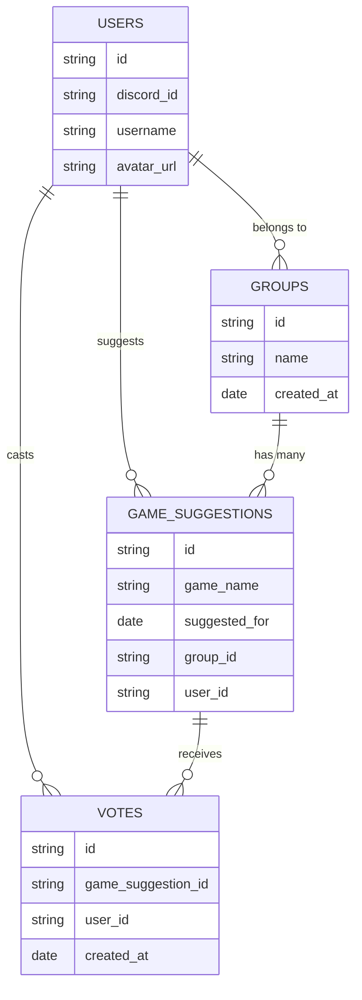

```mermaid
erDiagram
       USERS ||--o{ GROUPS : "belongs to"
       USERS ||--o{ GAME_SUGGESTIONS : suggests
       USERS ||--o{ VOTES : casts
       GROUPS ||--o{ GAME_SUGGESTIONS : "has many"
       GAME_SUGGESTIONS ||--o{ VOTES : "receives"
       
       USERS {
           string id
           string discord_id
           string username
           string avatar_url
       }
       GROUPS {
           string id
           string name
           date created_at
       }
       GAME_SUGGESTIONS {
           string id
           string game_name
           date suggested_for
           string group_id
           string user_id
       }
       VOTES {
           string id
           string game_suggestion_id
           string user_id
           date created_at
       }
```