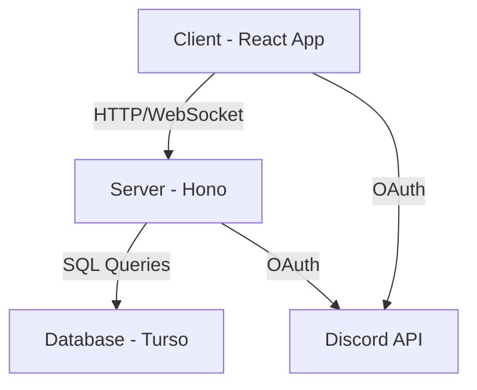

# QueueCrew - Technical Specification

## 1. Architecture Overview

QueueCrew will follow a client-server architecture with a React frontend and a Hono backend. The application will use Turso as its database and integrate with Discord for authentication.

### 1.1 High-Level Architecture Diagram



## 2. Frontend Architecture

- Framework: React
- State Management: React Context API for global state, local state for component-specific data
- Styling: Tailwind CSS for utility-first styling
- UI Components: shadcn/ui for pre-built, customizable components
- Routing: TanStack Router

## 3. Backend Architecture

- Framework: Hono
- API Design: RESTful API with WebSocket support for real-time updates
- Authentication: JSON Web Tokens (JWT) for session management
- Database Access: Drizzle ORM

## 4. Database Schema

The Turso database will use the following schema:

```sql
CREATE TABLE users (
    id TEXT PRIMARY KEY,
    discord_id TEXT UNIQUE NOT NULL,
    username TEXT NOT NULL,
    avatar_url TEXT,
    created_at TIMESTAMP DEFAULT CURRENT_TIMESTAMP
);

CREATE TABLE groups (
    id TEXT PRIMARY KEY,
    name TEXT NOT NULL,
    created_at TIMESTAMP DEFAULT CURRENT_TIMESTAMP
);

CREATE TABLE user_groups (
    user_id TEXT,
    group_id TEXT,
    role TEXT CHECK(role IN ('admin', 'member')) DEFAULT 'member',
    PRIMARY KEY (user_id, group_id),
    FOREIGN KEY (user_id) REFERENCES users(id),
    FOREIGN KEY (group_id) REFERENCES groups(id)
);

CREATE TABLE game_suggestions (
    id TEXT PRIMARY KEY,
    game_name TEXT NOT NULL,
    suggested_for DATE NOT NULL,
    group_id TEXT,
    user_id TEXT,
    created_at TIMESTAMP DEFAULT CURRENT_TIMESTAMP,
    FOREIGN KEY (group_id) REFERENCES groups(id),
    FOREIGN KEY (user_id) REFERENCES users(id)
);

CREATE TABLE votes (
    id TEXT PRIMARY KEY,
    game_suggestion_id TEXT,
    user_id TEXT,
    created_at TIMESTAMP DEFAULT CURRENT_TIMESTAMP,
    FOREIGN KEY (game_suggestion_id) REFERENCES game_suggestions(id),
    FOREIGN KEY (user_id) REFERENCES users(id),
    UNIQUE (game_suggestion_id, user_id)
);
```

## 5. Authentication Flow

1. User initiates login with Discord
2. App redirects to Discord OAuth endpoint
3. User authorizes the app on Discord
4. Discord redirects back to app with authorization code
5. Backend exchanges code for access token with Discord
6. Backend creates or updates user record, generates JWT
7. Frontend stores JWT for subsequent authenticated requests

## 6. Real-time Updates

WebSocket connections will be used for real-time updates on:
- New game suggestions
- Vote changes
- Group member activities

## 7. Caching Strategy

- Client-side caching: TanStackQuery for caching and invalidation of API responses
- Server-side caching: In-memory caching for frequently accessed data (e.g., group information)

## 8. Error Handling and Logging

- Frontend: Error boundaries in React for graceful error handling
- Backend: Global error handler middleware in Hono
- Logging: Winston for server-side logging, with different log levels for development and production

## 9. Performance Considerations

- Lazy loading of React components for improved initial load time
- Pagination of game suggestions and voting history
- Database indexing on frequently queried columns

## 10. Scalability

- Stateless backend design to allow for horizontal scaling
- Use of Turso's distributed nature for database scalability
- Potential implementation of a job queue for background tasks (e.g., Discord bot integration) in future iterations
